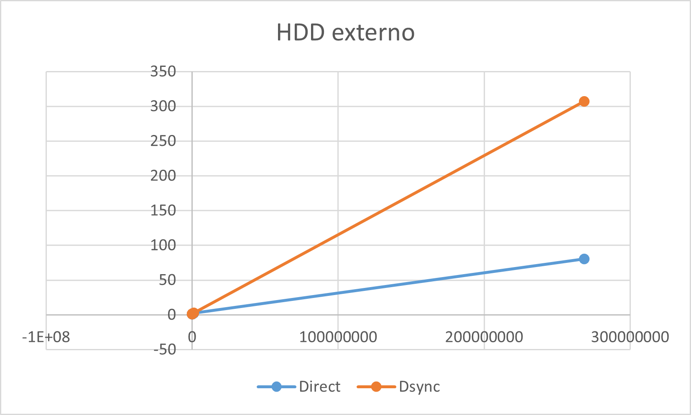
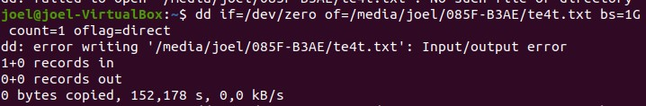

### CMP-3004

### Computer Organization

### Spring 2022

# Homework 4

## Internal SSD

_Specs_

    - Processor: Ryzen 7 Series 400 Octa-core
    - Ram: 16 GB DDR4
    - GPU: RTX 2060
    - Storage: M.2 SSD of 1 TB

We used the distribution ubuntu 20.06 of Linux in a virtual machine called Virtual Box. The commands we used were dd if=/dev/zero of=Escritorio/cmp3004/deber4/testfile.txt bs=256b count=1 oflag= direct, and we tested for different values of bs which were 256b, 4k, 16k, 256k, 1M, and finally 1G. Also we test with oflag=direct and oflag=dsync.

_Commands_

256b:

4k:

16k:

256k:

1M:

1G:

_Graph_  
We registered the following results:  

## Internal HDD

## External HDD

_Specs_

    - Removable flash drive
    - Capacity: 32GB

_Commands_

256b:

4096b:

16k:

256k:

1M:

256M:

1G:

_Graph (without 256Mb)_

_Graph_

## Conclusions

    - What do you observe?
    - What are the main differences between the three drives?
    - What are the differences in performance when we change the value of `bs`?

How do we explain the difference in performance of these two options `oflag=direct` and `oflag=dsync`?

oflag=direct will cause data to be written directly to the disk without going through the operating system's buffer cache. oflag=dsync will cause data to be written to the disk only after it is flushed from the operating system's buffer cache. oflag=direct will be faster if the operating system's buffer cache is not being used, while oflag=dsync will be faster if the operating system's buffer cache is being used.

_Unexpected problems_

1. Automatic ejection of flash drive while writing data

   
   dd command ejected flash drive when writing big amounts of data (>200Mb) and give an input/output error

   Possible causes:

   - The external flash drive could be faulty and not able to properly handle the data being written to it. (Our usb drive is an SD card with and adapter for USB, is very old, and it is used for saving pictures from cameras)

   - There is not enough space in the VM to write data into another drive. (We were given a warning about having less than 100Mb in the internal VM memory)

   - The external flash drive could be overfilled and not have enough space to properly store the data. (There is 27GB left in the flash drive, it is the least possible)

- Why we see differences in performance for different values of `bs`?
