### CMP-3004

### Computer Organization

### Spring 2022

# Homework 4

## Internal SSD
_Specs_

    - Processor: Ryzen 7 Series 400 Octa-core
    - Ram: 16 GB DDR4
    - GPU: RTX 2060 
    - Storage: M.2 SSD of 1 TB
     We used the distribution ubuntu 20.06 of Linux in a virtual machine called Virtual Box.  The commands we used were dd if=/dev/zero of=Escritorio/cmp3004/deber4/testfile.txt bs=256b count=1 oflag= direct,  and we tested for different values of bs which were 256b, 4k, 16k, 256k, 1M, and finally 1G.  Also we test with oflag=direct and oflag=dsync. 

_Commands_

256b:
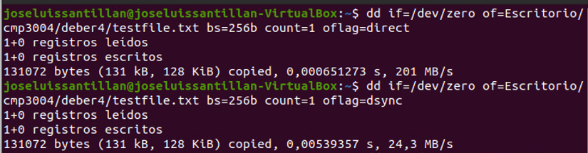
4k:
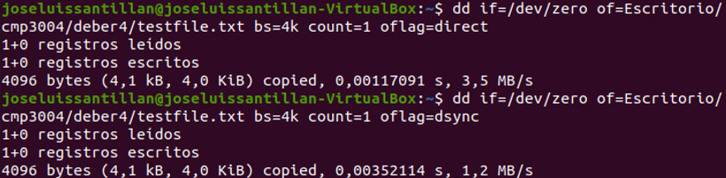
16k:
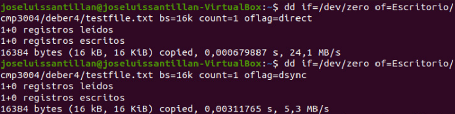
256k:
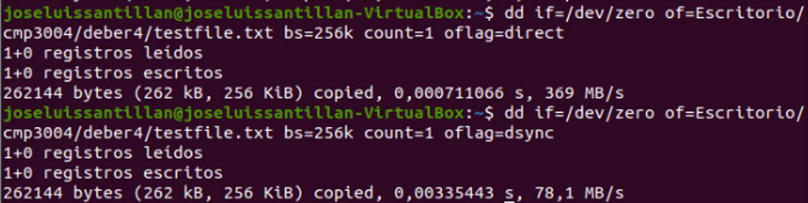
1M:

1G:
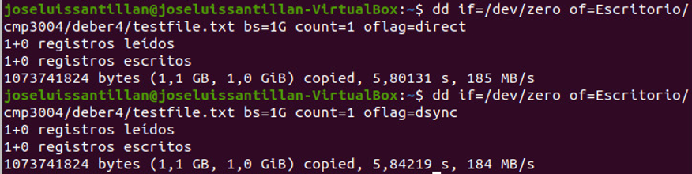

_Graph_  
We registered the following results:  
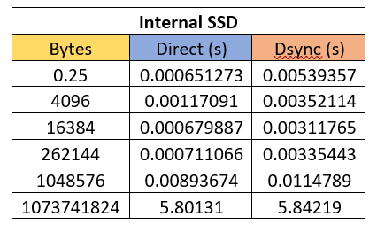
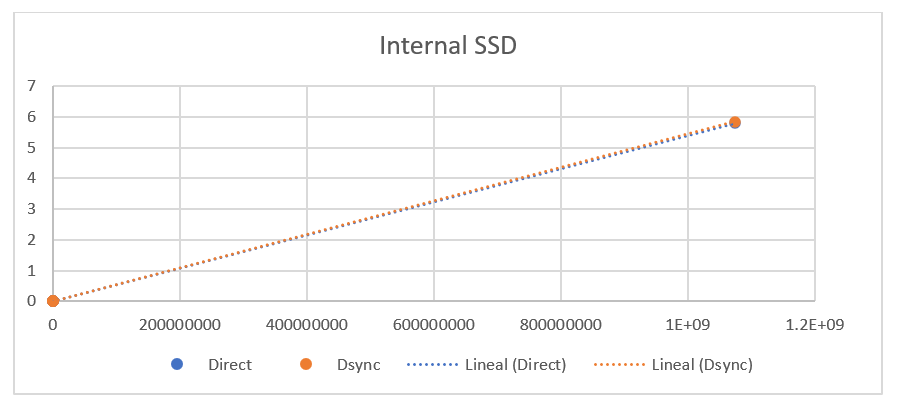
## Internal HDD

## External HDD

_Specs_

    - Removable flash drive
    - Capacity: 32GB

_Commands_

256b:
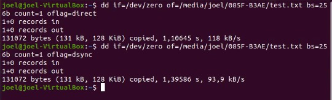
4096b:
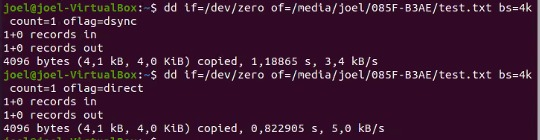
16k:
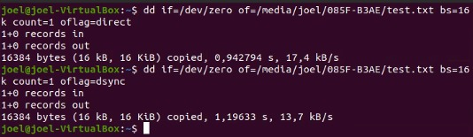
256k:
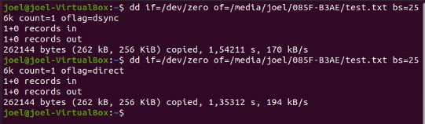
1M:
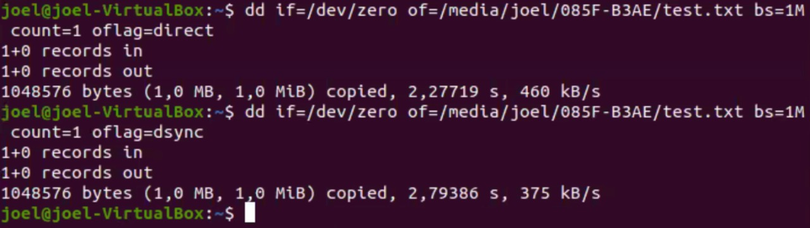
256M:
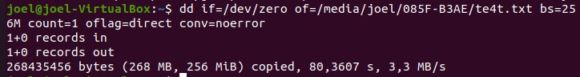
1G:
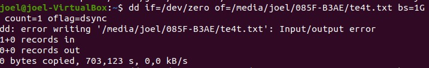

_Graph_
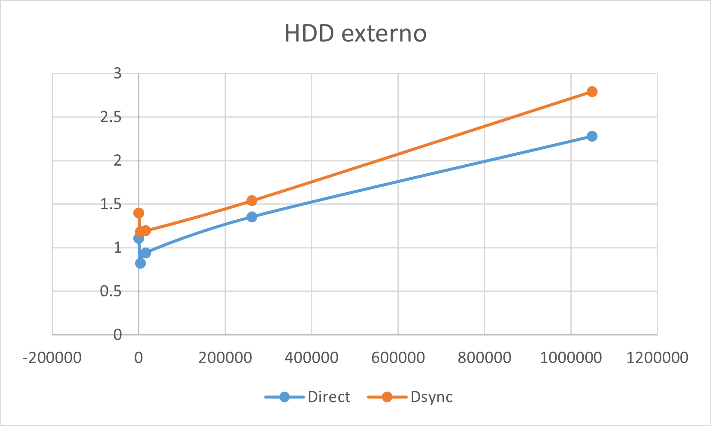

## Conclusions

    - What do you observe?
    - What are the main differences between the three drives?
    - What are the differences in performance when we change the value of `bs`?

- Why we see differences in performance for different values of `bs`?
- Try your experiments with `oflag=direct` and without it.
  - How do we explain the difference in performance of these two options?
