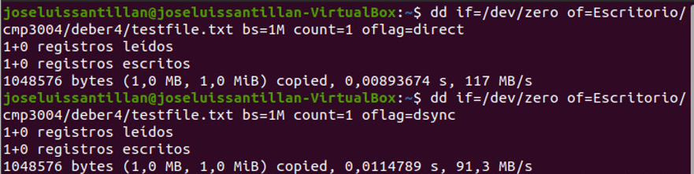
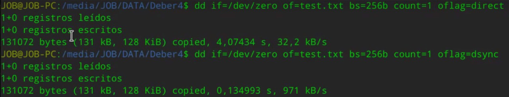
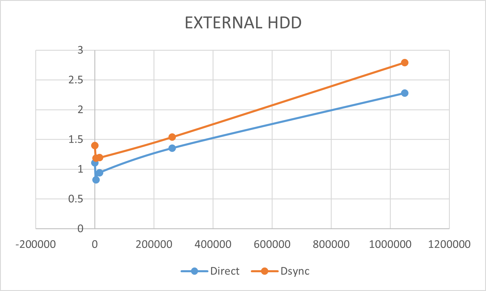
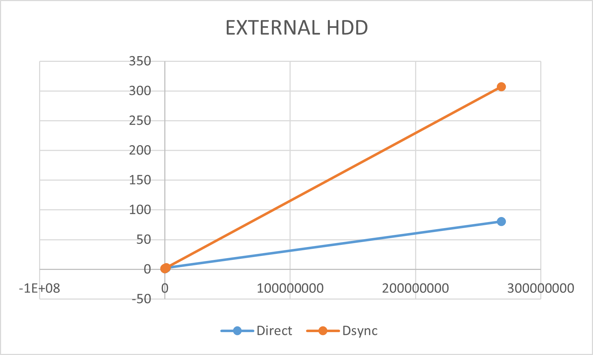

### CMP-3004

### Computer Organization

### Spring 2022

# Homework 4

## Internal SSD

_Specs_

    - Processor: Ryzen 7 Series 4000 Octa-core
    - Ram: 16 GB DDR4
    - GPU: RTX 2060
    - Storage: M.2 SSD of 1 TB

We used the distribution Ubuntu 20.04.3 LTS of Linux in a virtual machine called Virtual Box. The commands we used were dd if=/dev/zero of=Escritorio/cmp3004/deber4/testfile.txt bs=256b count=1 oflag= direct, and we tested for different values of bs which were 256b, 4k, 16k, 256k, 1M, and finally 1G. Also we test with oflag=direct and oflag=dsync.

_Commands_

256b:

4k:

16k:

256k:

1M:

1G:

_Graph_  
We registered the following results:  

## Internal HDD

_Specs_

    - Processor: Intel Core i7 (4th)
    - Ram: 16 GB DDR4
    - Seagate
    - Capacity: 2TB
    - GPU: Integrated Graphics

_Commands_

256b:

4k:

16k:

256k:

1M:

1G:

_Raw Data_

_Graph_

## External HDD

_Specs_

    - Processor: AMD Ryzen 5 4600H with Radeon Graphics 3.00 GHz
    - Ram: 8 GB DDR4
    - WD Elements HDD
    - Capacity: 1.5TB
    - GPU: Radeon Graphics

_Commands_

256b:

4096b:

16k:

256k:

1M:

256M:

1G:

_Raw (without 256Mb)_

_Graph (without 256Mb)_

_Graph_

## Conclusions

### What do you observe?

After analyzing the graphs:

1. The internal SSD has the least amount of transferred time of data. SSD stores data on interconnected flash memory chips, which can be read and written much faster than the spinning disks.
2. In all cases, `oflag=direct` had the best performance. The `oflag=dsync` flag tells `dd` to use the `sync_file_range()` system call, which will ensure that the data is written to disk before `dd` returns. This can also result in better performance, but it may be slower than `oflag=direct` because `sync_file_range()` may need to wait for the disk to flush its data.
3. An external HDD has worse performance than an internal SSD or an internal HDD because it is connected to the computer via a USB port, which is slower than the SATA port used by internal drives.

### What are the main differences between the three drives?

The main difference between magnetic internal hard drives, internal SSDs, and external drives is the speed at which data can be accessed. Hard drives tend to be the slowest, followed by SSDs, with external drives generally being the fastest. This is due to the fact that hard drives store data on spinning disks, which need to be accessed sequentially in order to be read or written to. SSDs, on the other hand, store data on interconnected HDD memory chips, which can be accessed much more quickly. External drives are also generally slower than internal drives, as they tend to use USB ports.

### Why we see differences in performance for different values of `bs`?

The `bs` parameter in the `dd` command specifies the number of bytes that are read or written at a time. A larger value for `bs` will result in fewer reads or writes, which can improve performance. However, if the value is too large, it can actually decrease performance.

1. A larger buffer will generally lead to better performance, as it allows dd to read/write more data at once.

2. The file system on which the input and output files are located may have different block sizes, which can also impact performance.

3. The speed of the storage devices used for the input and output files can also play a role in performance. For example, if you are writing to a slow USB drive, you will likely see better performance with a smaller `bs` value than if you were writing to a fast SSD.

- How do we explain the difference in performance of these two options `oflag=direct` and `oflag=dsync`?

oflag=direct will cause data to be written directly to the disk without going through the operating system's buffer cache. oflag=dsync will cause data to be written to the disk only after it is flushed from the operating system's buffer cache. oflag=direct will be faster if the operating system's buffer cache is not being used, while oflag=dsync will be faster if the operating system's buffer cache is being used.

Writing with `oflag=direct` flag was much faster than `oflag=dsync`since it did not use the buffer cache.

### Unexpected problems

- Automatic ejection of HDD drive while writing data

  
  dd command ejected HDD drive when writing big amounts of data (>200Mb) and give an input/output error

  Possible causes:

  - The external HDD drive could be faulty and not able to properly handle the data being written to it. (Our HDD is very old and it is used for saving pictures from cameras)

  - There is not enough space in the VM to write data into another drive. (We were given a warning about having less than 100Mb in the internal VM memory)

  - The external HDD drive could be overfilled and not have enough space to properly store the data. (There is 27GB left in the drive, it is the least possible)
